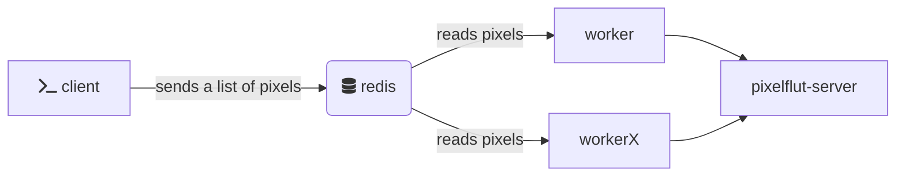

# ebbe

## completion

zsh

```
ebbe completion zsh > /usr/share/zsh/site-functions/_ebbe
```

## usage

ebbe is a modular application, there are commands to create pixelflut commands and there is one to send data to a pixelflut server.

to combine these commands, you can either pipe them together:

```
ebbe image --image enton.png | ebbe send --host :1337 --input -
```

or write them to file, merge them with other commands and then send it:

```
ebbe image --image enton.png > data.txt
ebbe color --color 000000 --color ffffff >> data.txt
ebbe send --input data.txt
```

In the above example the image will fight against the color. To remove all image pixels from color pixels you can run:

```
ebbe merge --input colors.txt --input image.txt | ebbe send -i -
```

I've wished to merge raw input, but the command gets to long for the shell. As an alternative, you can pass commands to merge, which will be executed and merged. To run the above example in one statement:

```
ebbe merge --commands --input "ebbe color --color 000000 --color ffffff" --input "ebbe image --image enton.png" | ebbe send -i -
```

## measure

ebbe features a dummy pixelflut server, which doesnt output anything, but just prints out the throughput.

Start it in one terminal with
```
ebbe measure
```

and then send data to it

```
ebbe image --image enton.png | ebbe send -i - --host :1337 -c 16 -p 4096
```

I reach a throughput of 30 GBit/s when running locally

## cluster



## examples

[see](/examples)
